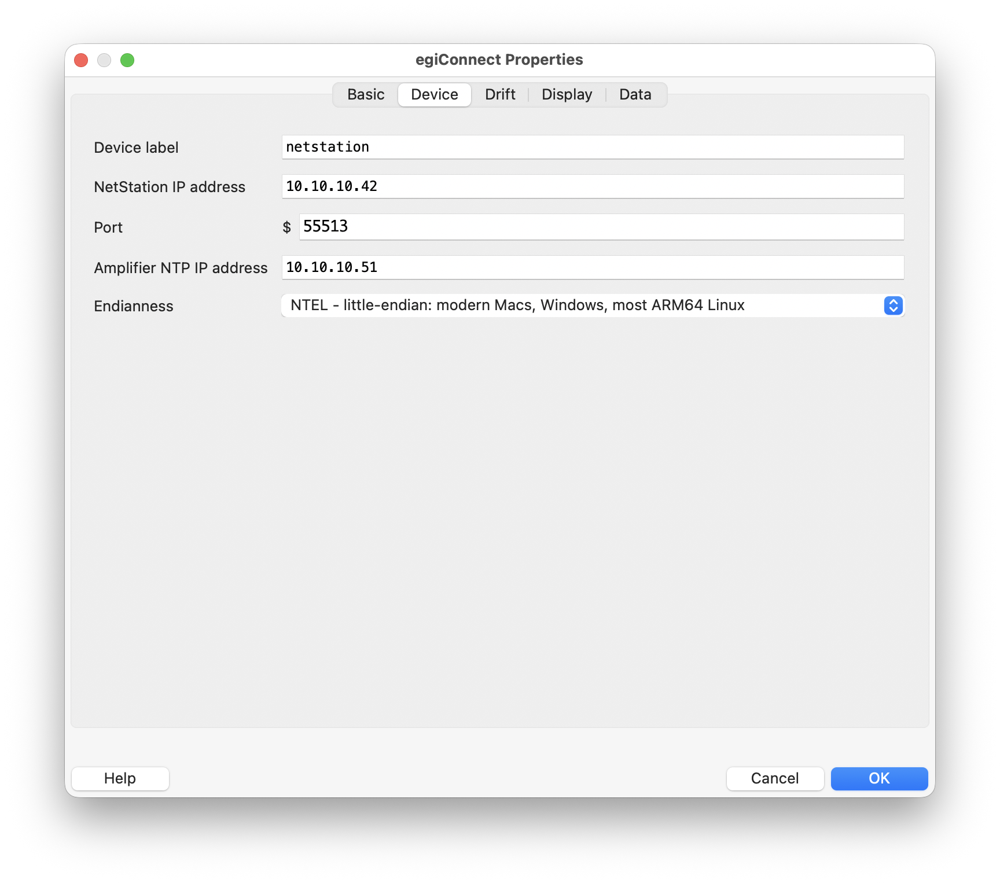
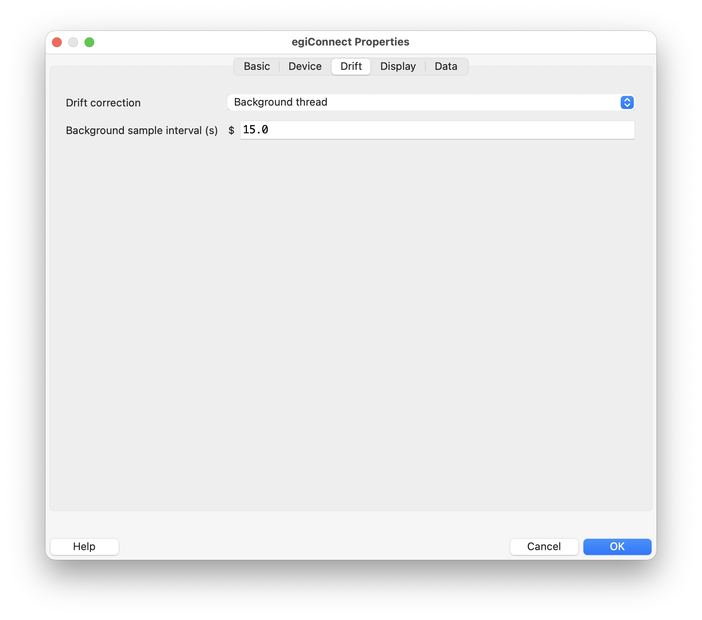
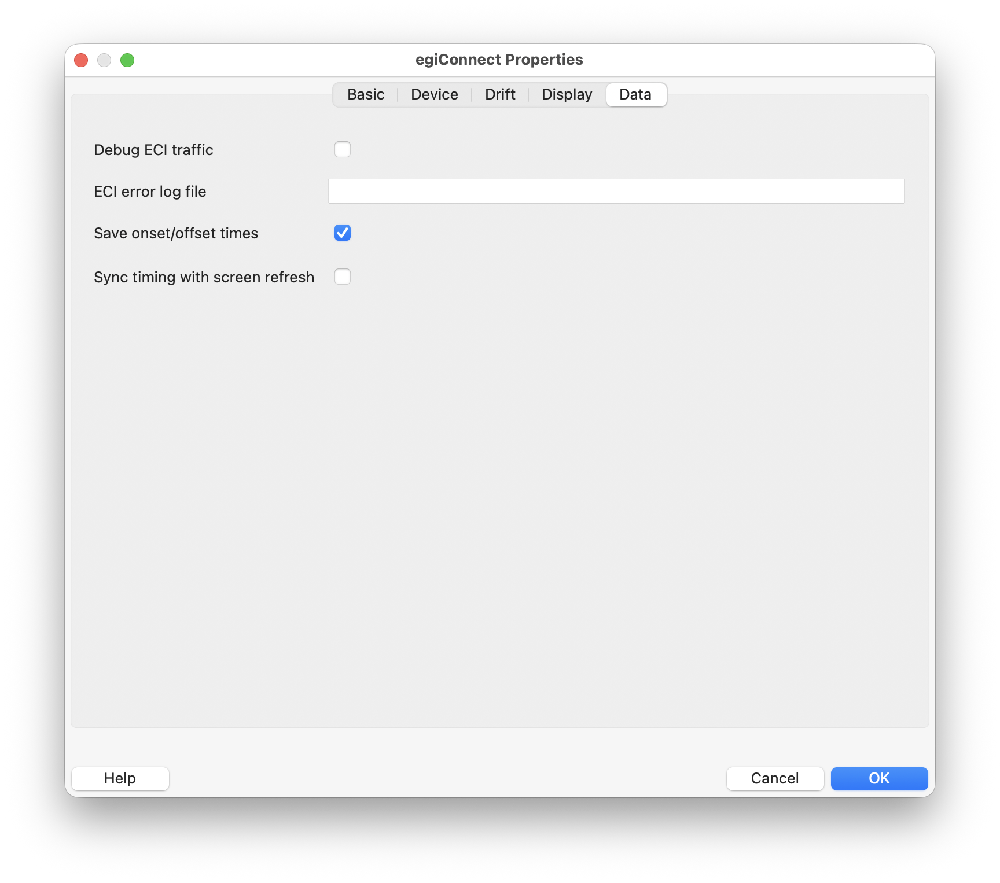
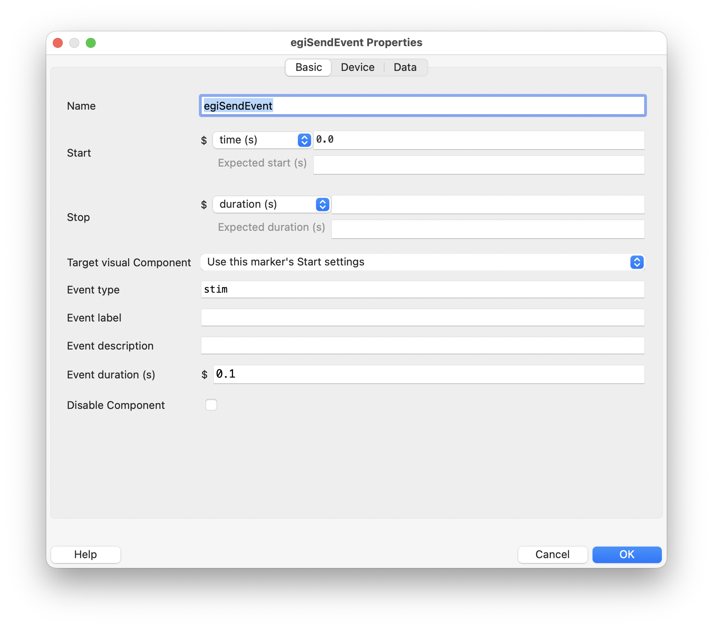
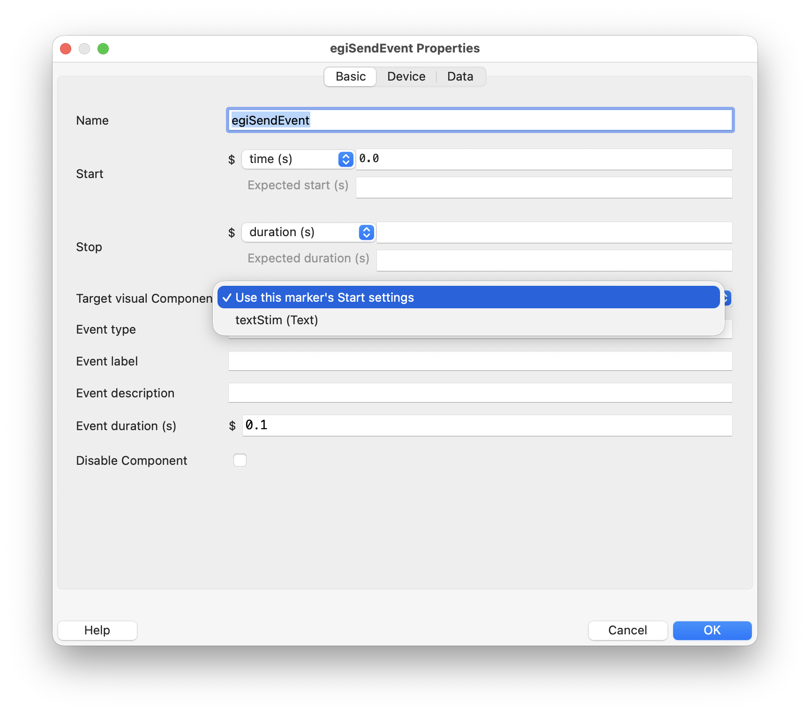

Builder Component reference
===========================

All five EGI Components are one-shot commands. They run once at their Builder
**Start** condition and do not use the **Stop** condition. Place them in Flow
order: Connect, Start Recording, Send Event as needed, Stop Recording, then
Disconnect.

Options shared by all Components
--------------------------------

PsychoPy supplies several standard fields to every Component.

.. list-table:: Common GUI options
   :header-rows: 1
   :widths: 24 16 60

   * - Option
     - Default
     - Meaning
   * - **Name**
     - ``egiConnect``, ``egiStartRecording``, ``egiSendEvent``,
       ``egiStopRecording``, or ``egiDisconnect``
     - A valid, unique Python identifier used in the generated experiment.
       Descriptive names are useful when a Routine has several markers.
   * - **Start** type and value
     - ``time (s)``, ``0.0``
     - Determines when the command fires. The value may be a literal or a
       Builder expression. For a visual event, schedule EGI Send Event at the
       same onset as the stimulus and enable flip synchronization.
   * - **Expected start (s)**
     - blank
     - Optional estimate used by PsychoPy when calculating experiment timing.
       It does not schedule the EGI command.
   * - **Stop** type and value
     - ``duration (s)``, blank
     - Ignored by these momentary commands. Leave it blank; use a separate EGI
       Stop Recording or Disconnect Component when that action is required.
   * - **Expected duration (s)**
     - blank
     - Optional PsychoPy timing estimate. It does not set event duration or
       keep a command active.
   * - **Device label**
     - ``netstation``
     - Internal text key used to retrieve the connection created by EGI
       Connect. Keep it identical on related EGI Components. It is not a
       Device Manager selection.
   * - **Save onset/offset times**
     - on
     - Saves PsychoPy Component timing to the experiment data. This records
       Builder timing, not an acknowledgement timestamp from NetStation.
   * - **Sync timing with screen refresh**
     - off
     - Standard PsychoPy start-time bookkeeping for Connect, Start Recording,
       Stop Recording, and Disconnect. These are network/control commands, so
       it normally stays off. EGI Send Event replaces it with the distinct
       **Sync to screen refresh** behavior documented below.
   * - **Disable Component**
     - off
     - Keeps the Component in the experiment file but omits its normal action
       when the experiment is generated or run.

EGI Connect
-----------

EGI Connect creates and registers the network client during experiment setup,
then opens its TCP/IP connection when the Component starts. Add exactly one
per amplifier before the other EGI Components that use its label.

Device tab
~~~~~~~~~~

.. list-table:: EGI Connect Device options
   :header-rows: 1
   :widths: 28 18 54

   * - Option
     - Default
     - Meaning
   * - **Device label**
     - ``netstation``
     - Shared internal name. Only change it when using multiple independent
       NetStation connections, and then use the matching label on every
       downstream Component.
   * - **NetStation IP address**
     - ``10.10.10.42``
     - Address of the computer running NetStation's ECI server. Replace the
       example with the address assigned by the lab.
   * - **Port**
     - ``55513``
     - TCP port on which the ECI server listens. The default is the usual ECI
       port; change it only when NetStation is configured differently.
   * - **Amplifier NTP IP address**
     - ``10.10.10.51``
     - Address of the amplifier's NTP server, used to establish and maintain
       the event timestamp clock. Leaving it blank makes the plugin use the
       NetStation host address.
   * - **Endianness**
     - ``NTEL``
     - ECI byte order for the computer running PsychoPy—not the amplifier.
       Use ``NTEL`` for modern Intel/Apple Silicon Macs, Windows x86/x64, and
       most ARM64 Linux systems. ``MAC-`` is for legacy big-endian PowerPC
       Macs; ``UNIX`` is for legacy big-endian Unix and is not appropriate for
       most modern Linux systems.

Drift tab
~~~~~~~~~

.. list-table:: EGI Connect Drift options
   :header-rows: 1
   :widths: 31 18 51

   * - Option
     - Default
     - Meaning
   * - **Drift correction**
     - ``Background thread``
     - Corrects event timestamps for drift between the PsychoPy and amplifier
       clocks. Background mode samples automatically and needs no extra
       Component. ``Off`` disables both correction and sampling.
   * - **Background sample interval (s)**
     - ``15.0``
     - Target time between background NTP drift samples. It is disabled in the
       GUI when drift correction is off. Sampling occurs on the library's
       background thread rather than in a Builder Routine.

Display tab
~~~~~~~~~~~

.. list-table:: EGI Connect Display options
   :header-rows: 1
   :widths: 35 14 51

   * - Option
     - Default
     - Meaning
   * - **Measure display refresh at startup**
     - on
     - Measures the actual refresh rate once during setup, logs the value, and
       writes a ``display_timing`` record when an ECI error log is configured.
       Measurement takes roughly 1–2 seconds and may drop frames, so the
       generated code never performs it during trials. It is diagnostic and
       does not alter experiment timing.
   * - **Warn about vulnerable schedules**
     - on
     - Compares fixed Routine durations with the measured frame period and
       warns about schedules whose onset phase can sweep by one frame. The
       option is disabled when refresh measurement is off. Variable and
       response-terminated Routines are skipped because their durations are
       not known at build time.

Data tab
~~~~~~~~

.. list-table:: EGI Connect Data options
   :header-rows: 1
   :widths: 30 16 54

   * - Option
     - Default
     - Meaning
   * - **Debug ECI traffic**
     - off
     - Prints every ECI command and response byte to the console. This can be
       noisy and should normally be enabled only while diagnosing protocol or
       connection problems.
   * - **ECI error log file**
     - blank
     - Optional path to a JSON-lines diagnostic log. The plugin records ECI
       errors there and, when refresh measurement is enabled, adds a
       ``display_timing`` record. Ensure the destination is writable and does
       not expose participant or machine-sensitive paths.
   * - **Strict ECI responses**
     - off
     - Makes rejected or malformed responses raise from blocking calls. An
       asynchronous marker cannot raise into the experiment thread, so its
       failure is still reported during cleanup. Leave this off for normal
       collection and enable it for diagnostic sessions.
   * - **Save onset/offset times**
     - on
     - Standard PsychoPy data logging for this Component. See the common
       options above.
   * - **Sync timing with screen refresh**
     - off
     - Standard PsychoPy scheduling option inherited by Connect. Connecting
       is a setup/network operation, not a visual marker, so leave this off.
       This is not the event-specific **Sync to screen refresh** setting on
       EGI Send Event.

At experiment end, EGI Connect safely stops an active recording, flushes queued
events, reports asynchronous worker failures, rejected ECI responses, and
drift-health problems, then disconnects. The same idempotent cleanup is
registered for early exits such as Escape. Explicit Stop Recording and
Disconnect Components are still recommended because they define the precise
recording endpoint rather than relying on shutdown cleanup.

EGI Start Recording
-------------------

Starts EEG recording when its **Start** condition is met. Starting recording
also performs the ECI NTP synchronization that establishes the event timestamp
epoch.

Its **Drift** tab can optionally wait until the upstream drift-correction model
reports it is ready. Leave **Wait until drift correction is ready** off for the
normal fast path. Turn it on for a diagnostic run, or for a planned pre-run
pause before timing-critical events, and choose the maximum wait time plus the
poll interval. The generated script calls ``waitForDrift(timeout=300.0,
poll=1.0)`` by default when the option is enabled. Because this can block for
minutes, do not place the Component where it can run near a visual flip.

One connection supports one recording epoch. To start another recording, first
stop and disconnect the current session, then reconnect before the next EGI
Start Recording Component runs.

EGI Send Event
--------------

Sends one event marker when its **Start** condition is met. Add one Component
for each distinct marker point, or use Builder variables in its fields.

Basic tab
~~~~~~~~~

   With **Use this marker's Start settings** selected, the marker uses its own
   Start fields. This is the default and preserves the original scheduling
   behavior.

   The target menu lists eligible visual Components in the same Routine. This
   example contains only one visual Component, so ``textStim (Text)`` is the
   only possible marker target. Experiments with several visual Components
   show each one by its Builder name and Component type.

.. list-table:: EGI Send Event Basic options
   :header-rows: 1
   :widths: 27 16 57

   * - Option
     - Default
     - Meaning
   * - **Target visual Component**
     - Use this marker's Start settings
     - Optionally binds the marker to the first drawing flip of a visual
       Component in the same Routine. Put EGI Send Event below the selected
       target. Selecting a target disables the marker's own Start controls
       because the target supplies the onset; binding is always flip
       synchronized regardless of the flip-sync setting. Invalid, disabled, or
       unsafely ordered targets stop code generation with an explanatory error.
   * - **Event type**
     - ``stim``
     - The main NetStation event identifier. It must contain exactly four
       characters. Use a meaningful, documented code such as ``stim``,
       ``resp``, or ``sync``.
   * - **Event label**
     - blank
     - Human-readable event label, up to 256 characters. When blank, the event
       type is used as the label.
   * - **Event description**
     - blank
     - Optional further description, up to 256 characters.
   * - **Event duration (s)**
     - ``0.1``
     - Duration stored with the NetStation event. The minimum accepted value
       is ``0.001`` seconds. This is independent of the ignored Builder
       **Stop** field.

Device and Data tabs
~~~~~~~~~~~~~~~~~~~~

.. list-table:: EGI Send Event Device and Data options
   :header-rows: 1
   :widths: 29 18 53

   * - Option
     - Default
     - Meaning
   * - **Device label**
     - ``netstation``
     - Selects the connection by its internal text label. It must match EGI
       Connect.
   * - **Event data**
     - blank
     - A Python dictionary of extra values, for example
       ``{'trl_': trialN, 'corr': True}``. Every key must contain exactly four
       characters. Values may be strings, booleans, integers, or floats.
       Because this is a code field, string literals need quotes.
   * - **Sync to screen refresh**
     - on
     - Queues the send through ``win.callOnFlip`` so its timestamp is captured
       on the flip that presents the stimulus. Keep it on for visual-onset
       markers. Turn it off for nonvisual events that should be timestamped
       immediately when the Component starts.
   * - **Save onset/offset times**
     - on
     - Standard PsychoPy Component timing output; it is separate from the
       event timestamp sent to NetStation.

Event sending is asynchronous, including inside the screen-flip callback. The
marker timestamp is captured immediately and network transmission happens
without blocking the display flip.

See :doc:`timing` for the equivalent Code Component pattern and an explanation
of how target status, Component order, and ``callOnFlip`` work together.

EGI Stop Recording
------------------

Stops EEG recording when its **Start** condition is met. Queued asynchronous
events are flushed first so a marker sent just beforehand is not discarded.
The only plugin-specific setting is **Device label**, which must match EGI
Connect. The Builder **Stop** field is not used.

EGI Disconnect
--------------

Closes the TCP/IP connection when its **Start** condition is met. Queued events
are flushed before the connection closes. Place it after EGI Stop Recording.
Its only plugin-specific setting is **Device label**; the other visible fields
are the common options described at the start of this page.
