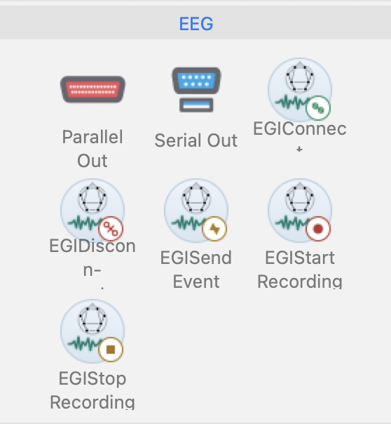

Getting started
===============

Requirements
------------

You need Python 3.10 or newer, PsychoPy 2026.1 or newer, and a
network-reachable NetStation host with ECI enabled. Ask the NetStation
administrator for three values:

* the IP address of the computer running NetStation;
* the ECI port, normally ``55513``; and
* the amplifier's NTP server IP address.

Install
-------

Install the package in the Python environment used by PsychoPy, then restart
PsychoPy so Builder discovers the new entry points:

.. code-block:: console

   python -m pip install psychopy-egi-pynetstation

Until the first PyPI release, install the source directly:

.. code-block:: console

   python -m pip install git+https://github.com/pmolfese/psychopy-egi-pynetstation.git

Choose an interface
-------------------

The installation supports three interfaces to the same NetStation wrapper:

* **Builder Components** for experiments assembled in PsychoPy Builder;
* a **direct Python import** for the smallest code-only setup; or
* PsychoPy's **Device Manager** when a code experiment already uses its shared
  device registry.

Builder is not required for either Python option. See :doc:`python-api` for the
two code-only forms and their common recording workflow.

Builder quick start
-------------------

Open Builder's Components panel and expand **I/O > EEG**. The five EGI
Components should appear alongside PsychoPy's other EEG components.

Add the Components to the Flow in this order:

.. rst-class:: workflow

1. **EGI Connect** near the beginning. Enter the NetStation IP, ECI port, and
   amplifier NTP IP.
2. **EGI Start Recording** after the connection is established.
3. **EGI Send Event** wherever a marker is needed. Use a four-character event
   type such as ``stim`` or ``resp``.
4. **EGI Stop Recording** near the end.
5. **EGI Disconnect** after recording has stopped.

Keep **Device label** set to ``netstation`` on every EGI Component. This is a
plain internal name used to share the connection, not a Device Manager item.
An empty Device Manager list is expected because NetStation amplifiers cannot
be auto-discovered.

These are momentary commands: each runs once when its Component starts. A
Component's **Stop** field does not control the command and should normally be
left blank. **Event duration (s)** on EGI Send Event is different—it is the
duration stored with the NetStation event.

Each EGI Component has independent Builder timing state even though all of them
share the connection named by **Device label**, so multiple EGI commands may be
scheduled in one Routine. EGI Connect also installs an idempotent shutdown safety
net which stops an active recording, flushes events, and disconnects on normal or
early experiment exit. Keep the explicit Stop Recording and Disconnect Components
to control exactly when those actions occur.

.. _coder-quick-start:

Coder quick start
-----------------

Builder is not required. In PsychoPy Coder, directly import the wrapper for the
smallest setup. The example below creates a window, connects, starts recording,
marks one visual flip, and cleans up safely:

.. code-block:: python

   from psychopy import visual
   from psychopy_egi_pynetstation import EGINetStation

   win = visual.Window()
   ns = EGINetStation(
       ip="10.10.10.42",
       ntpIP="10.10.10.51",
       port=55513,
   )

   try:
       ns.connect()
       ns.beginRecording()

       win.callOnFlip(
           ns.sendEvent,
           eventType="stim",  # exactly four characters
           label="face",
           duration=0.1,
       )
       win.flip()
   finally:
       ns.close()
       win.close()

Coder with Device Manager
~~~~~~~~~~~~~~~~~~~~~~~~~

When a Coder experiment already uses PsychoPy's shared device registry, create
the same wrapper through ``DeviceManager`` instead:

.. code-block:: python

   from psychopy.hardware import DeviceManager

   ns = DeviceManager.addDevice(
       deviceClass="psychopy_egi_pynetstation.hardware.netstation.EGINetStation",
       deviceName="netstation",
       ip="10.10.10.42",
       ntpIP="10.10.10.51",
       port=55513,
   )

Then use the same ``ns.connect()``, ``ns.beginRecording()``,
``win.callOnFlip(ns.sendEvent, ...)``, and ``ns.close()`` workflow shown above.
Retrieve the registered object later with
``DeviceManager.getDevice("netstation")``. See :doc:`python-api` for method
details and non-visual event usage.

Preflight checklist
-------------------

Before collecting data:

* confirm that ECI is enabled and the PsychoPy computer can reach the host and
  NTP addresses;
* send a four-character test event and verify its label and duration in
  NetStation;
* stop recording and disconnect cleanly so queued asynchronous events flush;
* inspect the PsychoPy log for ``NetStation events failed to send``; and
* validate the workflow using non-production data on the actual lab network.
